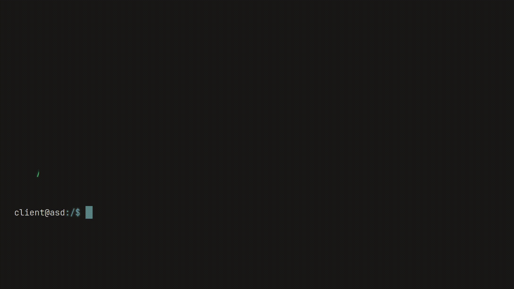
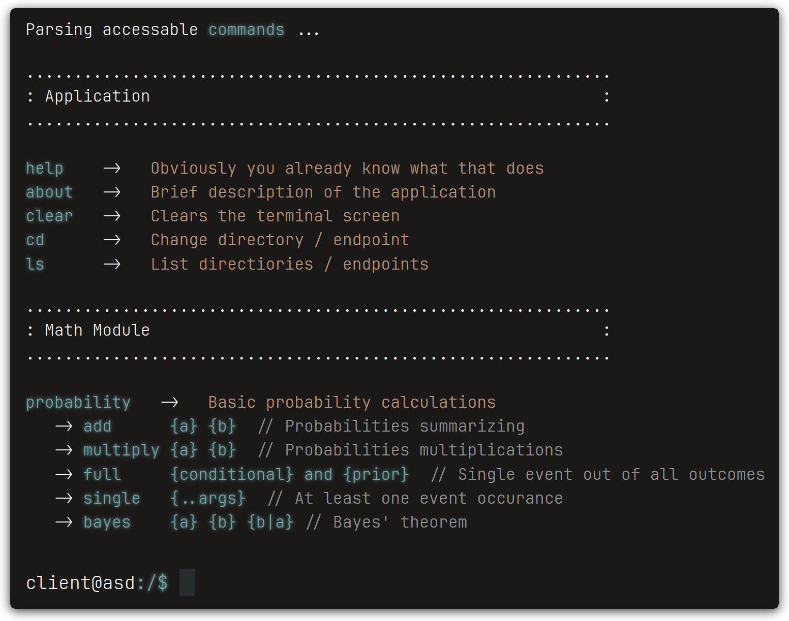
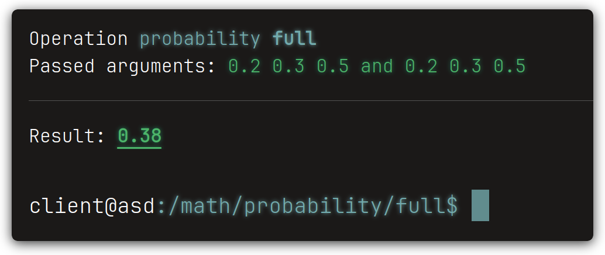

<div align="center">

   # **Unix-based web test machine**

   
   
   
   
</div>

<br>

## Description:
Simple PHP/Symfony project made to be dumped, tested on, played with and so on.

A remake of the one made on Python/Flask, just love the idea of a terminal inside of a browser window.

## The vibe:



## Development:
#### Requirements:
```
PHP 7.4.1+
Symfony 5.4
Composer 2.7.1
```

```bash
git clone git@github.com:aASDa213ASD/emperical-methods.git

composer install

php bin/console cache:clear
```